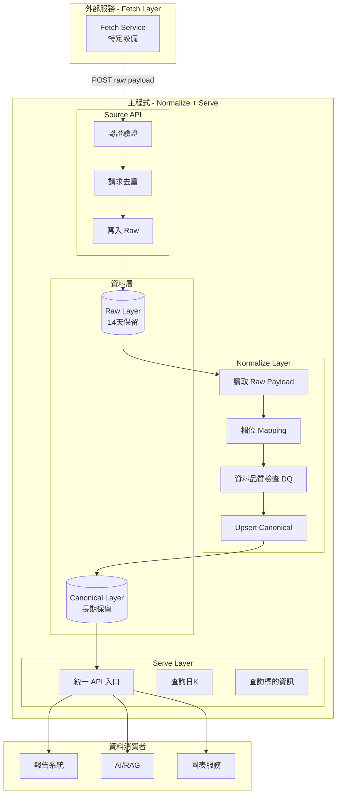
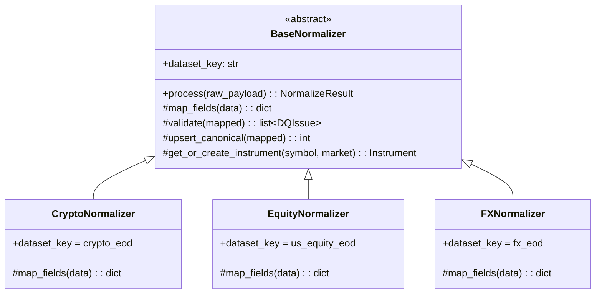
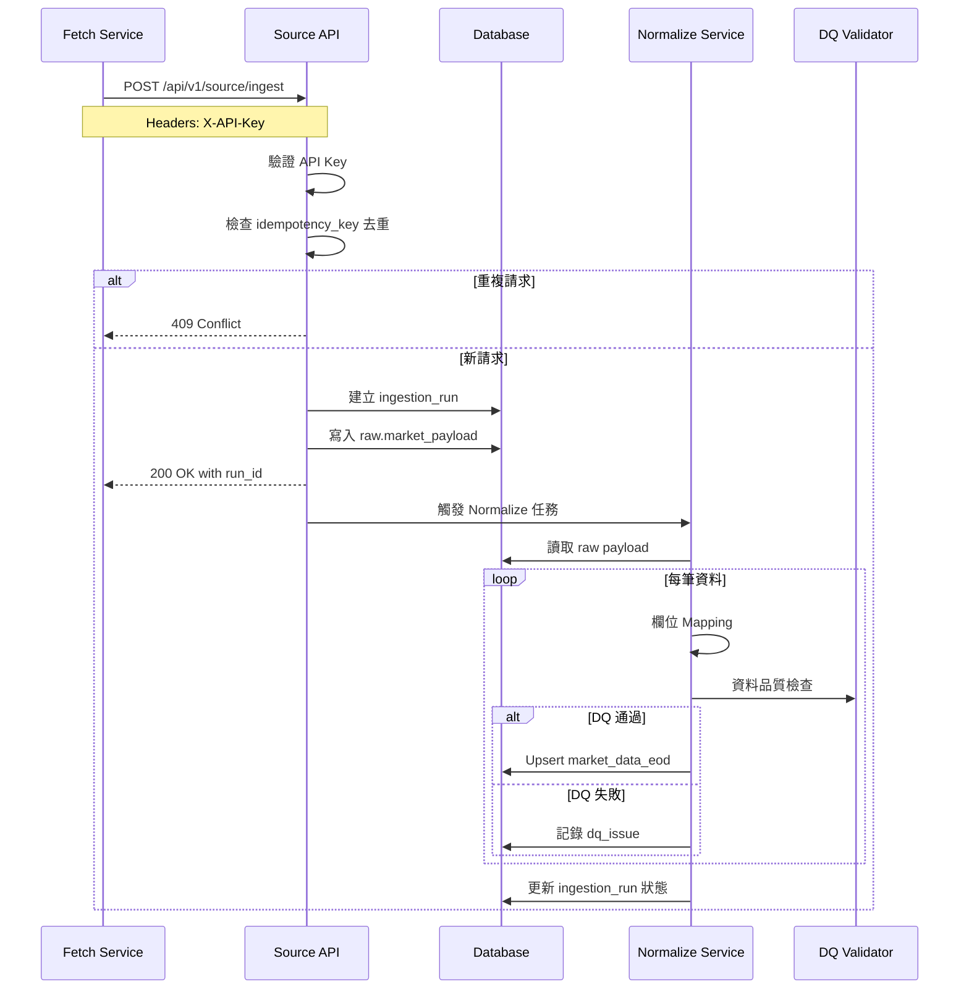

# Normalize 與 Serve 層開發計劃

> **建立時間**: 2026-01-21
> **狀態更新**: 2026-04-08
> **負責範圍**: Normalize Layer + Serve Layer
> **技術選型**: Python + FastAPI + PostgreSQL
> **目標市場**: Phase 1（加密貨幣、美股、全球外匯）

> 目前補充說明：
> - Phase 0 共用底座已完成。
> - Phase 1 主流程已可用，另已提前實作部分 Phase 2 / 3 能力（TW/HK/CN、Macro、WTX、Admin）。
> - 最新整體狀態請以 [roadmap.md](roadmap.md) 為主，本文件保留較細的開發拆解與歷史脈絡。

---

## 一、專案概述

根據 [roadmap.md](roadmap.md) 與 [spec.md](spec.md) 的架構設計，本計劃負責開發金融資料庫的 **Normalize** 與 **Serve** 兩層。

### 系統架構圖



---

## 二、開發階段規劃

### Phase 0：共用底座建立

此階段建立核心基礎設施，使後續市場能快速接入。

#### 0.1 專案結構與環境設置

- [x] 建立專案目錄結構
- [x] 設定 Python 虛擬環境與依賴管理（Poetry 或 pip）
- [x] 設定 FastAPI 基本框架
- [x] 設定資料庫連線與 ORM（SQLAlchemy）
- [x] 設定環境變數管理（.env）
- [x] 建立 Docker Compose 開發環境（PostgreSQL）

**專案目錄結構建議**：
```
findb/
├── app/
│   ├── __init__.py
│   ├── main.py                 # FastAPI 應用入口
│   ├── config.py               # 設定管理
│   ├── dependencies.py         # 依賴注入
│   │
│   ├── api/                    # API 路由
│   │   ├── __init__.py
│   │   ├── v1/
│   │   │   ├── __init__.py
│   │   │   ├── source.py       # Source API 端點
│   │   │   └── serve.py        # Serve API 端點
│   │   └── deps.py             # API 依賴（認證等）
│   │
│   ├── models/                 # SQLAlchemy 模型
│   │   ├── __init__.py
│   │   ├── base.py
│   │   ├── raw.py              # Raw Layer 模型
│   │   ├── canonical.py        # Canonical Layer 模型
│   │   └── registry.py         # 系統註冊表模型
│   │
│   ├── schemas/                # Pydantic 模型（API Request/Response）
│   │   ├── __init__.py
│   │   ├── source.py
│   │   ├── serve.py
│   │   └── common.py
│   │
│   ├── services/               # 業務邏輯
│   │   ├── __init__.py
│   │   ├── normalize/
│   │   │   ├── __init__.py
│   │   │   ├── base.py         # 基礎 Normalizer
│   │   │   ├── crypto.py       # 加密貨幣 Normalizer
│   │   │   ├── equity.py       # 股票 Normalizer
│   │   │   └── fx.py           # 外匯 Normalizer
│   │   ├── dq/                 # 資料品質檢查
│   │   │   ├── __init__.py
│   │   │   └── validators.py
│   │   └── ingestion.py        # 資料攝取服務
│   │
│   └── utils/                  # 工具函式
│       ├── __init__.py
│       ├── uuid7.py            # UUID v7 生成
│       └── datetime.py         # 時間處理
│
├── migrations/                 # Alembic 資料庫遷移
│   └── versions/
│
├── tests/                      # 測試
│   ├── __init__.py
│   ├── conftest.py
│   ├── test_source_api.py
│   └── test_normalize.py
│
├── scripts/                    # 腳本
│   └── cleanup_raw.py          # Raw 資料清理腳本
│
├── docker-compose.yml
├── Dockerfile
├── pyproject.toml              # 或 requirements.txt
├── .env.example
└── README.md
```

#### 0.2 資料庫 Schema 設計

- [x] 建立 Raw Schema（raw）
- [x] 建立 Canonical Schema（public 或 canonical）
- [x] 設計並建立核心資料表

**Raw Layer 資料表**：

```sql
-- Schema: raw
CREATE SCHEMA IF NOT EXISTS raw;

-- raw.market_payload - 原始資料暫存
CREATE TABLE raw.market_payload (
    id UUID PRIMARY KEY,                    -- UUID v7
    dataset_key VARCHAR(50) NOT NULL,       -- 如: crypto_eod, us_equity_eod
    source VARCHAR(50) NOT NULL,            -- 如: bloomberg, yahoo
    request_key VARCHAR(100) NOT NULL,      -- 上游請求識別（追蹤）
    idempotency_key VARCHAR(100) NOT NULL,  -- 去重主鍵
    payload JSONB NOT NULL,                 -- 原始 JSON 資料
    fetched_at TIMESTAMPTZ NOT NULL,        -- 抓取時間
    expire_at TIMESTAMPTZ NOT NULL,         -- 過期時間（fetched_at + 14 days）
    run_id UUID NOT NULL,                   -- 關聯 ingestion_run
    created_at TIMESTAMPTZ DEFAULT NOW(),
    
    CONSTRAINT uq_idempotency_key UNIQUE (dataset_key, idempotency_key)
);

CREATE INDEX idx_mp_expire ON raw.market_payload(expire_at);
CREATE INDEX idx_mp_dataset ON raw.market_payload(dataset_key);
CREATE INDEX idx_mp_run ON raw.market_payload(run_id);
```

**Canonical Layer 資料表**：

```sql
-- 標的主檔
CREATE TABLE instruments (
    instrument_id UUID PRIMARY KEY,         -- UUID v7
    asset_class VARCHAR(20) NOT NULL,       -- equity, index, fx, crypto, bond, future, macro
    market VARCHAR(10) NOT NULL,            -- US, TW, HK, CN, FX, CRYPTO, WTX, MACRO
    symbol VARCHAR(50) NOT NULL,
    name VARCHAR(200),
    currency VARCHAR(10),
    timezone VARCHAR(50),
    status VARCHAR(20) DEFAULT 'active',    -- active, delisted
    listed_date DATE,
    delisted_date DATE,
    extra JSONB,                            -- 額外欄位
    created_at TIMESTAMPTZ DEFAULT NOW(),
    updated_at TIMESTAMPTZ DEFAULT NOW(),
    
    CONSTRAINT uq_instrument UNIQUE (asset_class, market, symbol)
);

CREATE INDEX idx_inst_market ON instruments(market);
CREATE INDEX idx_inst_status ON instruments(status);

-- 代碼映射表
CREATE TABLE instrument_identifiers (
    id UUID PRIMARY KEY,
    instrument_id UUID NOT NULL REFERENCES instruments(instrument_id),
    id_type VARCHAR(30) NOT NULL,           -- bloomberg, isin, cusip, sedol, internal
    id_value VARCHAR(100) NOT NULL,
    source VARCHAR(50),
    valid_from DATE,
    valid_to DATE,
    created_at TIMESTAMPTZ DEFAULT NOW(),
    
    CONSTRAINT uq_identifier UNIQUE (id_type, id_value, valid_from)
);

CREATE INDEX idx_ident_inst ON instrument_identifiers(instrument_id);
CREATE INDEX idx_ident_type_value ON instrument_identifiers(id_type, id_value);

-- 交易日曆
CREATE TABLE trading_calendar (
    id UUID PRIMARY KEY,
    market VARCHAR(10) NOT NULL,
    trade_date DATE NOT NULL,
    is_open BOOLEAN DEFAULT TRUE,
    session_open TIME,
    session_close TIME,
    holiday_name VARCHAR(100),
    
    CONSTRAINT uq_calendar UNIQUE (market, trade_date)
);

CREATE INDEX idx_cal_market_date ON trading_calendar(market, trade_date);

-- 日K主表
CREATE TABLE market_data_eod (
    id UUID PRIMARY KEY,
    instrument_id UUID NOT NULL REFERENCES instruments(instrument_id),
    trade_date DATE NOT NULL,
    open DECIMAL(20, 8),
    high DECIMAL(20, 8),
    low DECIMAL(20, 8),
    close DECIMAL(20, 8),
    volume BIGINT,
    turnover DECIMAL(20, 4),
    source VARCHAR(50),
    asof_ts TIMESTAMPTZ NOT NULL,           -- 資料時效時間
    run_id UUID,
    created_at TIMESTAMPTZ DEFAULT NOW(),
    updated_at TIMESTAMPTZ DEFAULT NOW(),
    
    CONSTRAINT uq_eod UNIQUE (instrument_id, trade_date)
);

CREATE INDEX idx_eod_inst_date ON market_data_eod(instrument_id, trade_date);
CREATE INDEX idx_eod_date ON market_data_eod(trade_date);

-- 資料集註冊表
CREATE TABLE dataset_registry (
    dataset_key VARCHAR(50) PRIMARY KEY,
    name VARCHAR(100) NOT NULL,
    description TEXT,
    asset_class VARCHAR(20) NOT NULL,
    market VARCHAR(10) NOT NULL,
    frequency VARCHAR(20) DEFAULT 'daily',
    is_active BOOLEAN DEFAULT TRUE,
    config JSONB,                           -- mapping 設定等
    created_at TIMESTAMPTZ DEFAULT NOW(),
    updated_at TIMESTAMPTZ DEFAULT NOW()
);

-- 資料攝取批次記錄
CREATE TABLE ingestion_run (
    run_id UUID PRIMARY KEY,
    dataset_key VARCHAR(50) NOT NULL REFERENCES dataset_registry(dataset_key),
    status VARCHAR(20) DEFAULT 'pending',   -- pending, processing, completed, failed
    started_at TIMESTAMPTZ,
    completed_at TIMESTAMPTZ,
    total_records INTEGER DEFAULT 0,
    success_records INTEGER DEFAULT 0,
    failed_records INTEGER DEFAULT 0,
    error_message TEXT,
    metadata JSONB,
    created_at TIMESTAMPTZ DEFAULT NOW()
);

CREATE INDEX idx_run_dataset ON ingestion_run(dataset_key);
CREATE INDEX idx_run_status ON ingestion_run(status);

-- 資料品質問題記錄
CREATE TABLE dq_issue (
    id UUID PRIMARY KEY,
    run_id UUID REFERENCES ingestion_run(run_id),
    instrument_id UUID REFERENCES instruments(instrument_id),
    trade_date DATE,
    issue_type VARCHAR(50) NOT NULL,        -- invalid_ohlc, duplicate, missing_field, etc
    severity VARCHAR(20) DEFAULT 'warning', -- info, warning, error, critical
    description TEXT,
    raw_data JSONB,
    resolved BOOLEAN DEFAULT FALSE,
    resolved_at TIMESTAMPTZ,
    created_at TIMESTAMPTZ DEFAULT NOW()
);

CREATE INDEX idx_dq_run ON dq_issue(run_id);
CREATE INDEX idx_dq_resolved ON dq_issue(resolved);
```

#### 0.3 Source API 開發

- [x] 實作 API Key 認證中間件
- [x] 實作請求去重（idempotency）機制
- [x] 實作 `/api/v1/source/ingest` 端點
- [x] 實作 ingestion_run 建立邏輯
- [x] 實作 raw.market_payload 寫入邏輯

**Source API 端點設計**：

| 方法 | 路徑 | 說明 |
|------|------|------|
| POST | /api/v1/source/ingest | 接收 raw payload |
| GET | /api/v1/source/runs/{run_id} | 查詢批次狀態 |
| GET | /api/v1/source/datasets | 查詢可用資料集 |

**請求格式**：
```json
{
  "dataset_key": "crypto_eod",
  "source": "bloomberg",
  "request_key": "bloomberg_crypto_20260116_144914",
  "idempotency_key": "bloomberg_crypto_20260116_144914",
  "payload": {
    "metadata": { ... },
    "data": [ ... ]
  },
  "fetched_at": "2026-01-16T14:49:14Z"
}
```

**回應格式**：
```json
{
  "success": true,
  "run_id": "01934def-1234-7abc-...",
  "status": "pending",
  "message": "Data received, processing queued"
}
```

#### 0.4 Raw 資料清理機制

- [x] 實作每日清理排程腳本
- [x] 建立清理日誌記錄

```python
# scripts/cleanup_raw.py
async def cleanup_expired_raw():
    """刪除已過期的 raw 資料"""
    deleted = await db.execute(
        delete(RawMarketPayload)
        .where(RawMarketPayload.expire_at < datetime.utcnow())
    )
    logger.info(f"Cleaned up {deleted.rowcount} expired raw records")
```

---

### Phase 0.5：Normalize Layer 核心開發

#### 0.5.1 基礎 Normalizer 架構

- [x] 設計 Normalizer 基礎類別（抽象類別）
- [x] 實作 mapping 配置機制
- [x] 實作 instrument 對齊邏輯
- [x] 實作 Canonical upsert 邏輯

**Normalizer 類別設計**：


#### 0.5.2 資料品質檢查（DQ）

- [x] 實作 OHLC 基本規則驗證
- [x] 實作主鍵重複檢查
- [x] 實作異常報酬率檢測
- [x] 實作 DQ issue 記錄機制

**DQ 規則清單**：

| 規則代碼 | 說明 | 嚴重程度 | 阻斷 |
|---------|------|---------|------|
| OHLC_HIGH_CHECK | high >= max(open, close) | error | 是 |
| OHLC_LOW_CHECK | low <= min(open, close) | error | 是 |
| VOLUME_POSITIVE | volume >= 0 | error | 是 |
| DUPLICATE_KEY | instrument_id + trade_date 不重複 | error | 是 |
| ABNORMAL_RETURN | 單日報酬超過 ±30% | warning | 否 |
| MISSING_OHLC | OHLC 任一欄位為 null | warning | 否 |

---

### Phase 1：加密貨幣市場支援

#### 1.1 加密貨幣 Normalizer

- [x] 實作 `CryptoNormalizer` 類別
- [x] Bloomberg 加密貨幣欄位 mapping
- [x] 建立加密貨幣 instrument 主檔
- [x] 建立 Bloomberg ticker 映射

**Mapping 對照表（Bloomberg Crypto → Canonical）**：

| Bloomberg 欄位 | Canonical 欄位 | 轉換邏輯 |
|---------------|---------------|---------|
| price.open | open | 直接映射 |
| price.high | high | 直接映射 |
| price.low | low | 直接映射 |
| price.last | close | 映射為收盤價 |
| - | volume | null（Bloomberg 不提供） |
| - | turnover | null |
| timestamp.last_update | trade_date | 解析日期 |
| metadata.source | source | 直接映射 |

**初始加密貨幣清單**：

| symbol | name | Bloomberg Ticker |
|--------|------|-----------------|
| BTC | Bitcoin | XBTUSD BGN Curncy |
| ETH | Ethereum | XETUSD BGN Curncy |
| XRP | Ripple | XRP Curncy |
| SOL | Solana | XSO Curncy |
| ADA | Cardano | XAD BGN Curncy |

#### 1.2 Dataset Registry 設定

- [x] 建立 `crypto_eod` dataset 設定
- [x] 設定 mapping 配置

```json
{
  "dataset_key": "crypto_eod",
  "name": "加密貨幣日K",
  "asset_class": "crypto",
  "market": "CRYPTO",
  "frequency": "daily",
  "config": {
    "source_format": "bloomberg_crypto",
    "field_mapping": {
      "open": "price.open",
      "high": "price.high",
      "low": "price.low",
      "close": "price.last",
      "trade_date": "timestamp.last_update"
    },
    "identifier_type": "bloomberg",
    "identifier_field": "ticker"
  }
}
```

---

### Phase 1.5：美股與外匯支援（框架建立）

#### 1.5.1 美股 Normalizer

- [x] 實作 `EquityNormalizer` 類別（US Market）
- [x] 實作 `IndexNormalizer` 類別
- [x] 提供通用 mapping（可依資料格式調整）

#### 1.5.2 外匯 Normalizer

- [x] 實作 `FXNormalizer` 類別
- [x] 提供通用 mapping（可依資料格式調整）

---

### Phase 2：Serve Layer 開發

#### 2.1 Serve API 設計

- [x] 設計 API 端點結構
- [x] 實作查詢過濾與分頁
- [x] 實作回應格式標準化

**Serve API 端點設計**：

| 方法 | 路徑 | 說明 |
|------|------|------|
| GET | /api/v1/serve/instruments | 查詢標的清單 |
| GET | /api/v1/serve/instruments/{id} | 查詢單一標的 |
| GET | /api/v1/serve/eod | 查詢日K資料 |
| GET | /api/v1/serve/eod/{instrument_id} | 查詢單一標的日K |
| GET | /api/v1/serve/calendar | 查詢交易日曆 |

**查詢參數設計**：

```
GET /api/v1/serve/eod?
    market=CRYPTO&
    symbols=BTC,ETH&
    start_date=2026-01-01&
    end_date=2026-01-16&
    page=1&
    page_size=100
```

**回應格式**：
```json
{
  "success": true,
  "data": [
    {
      "instrument_id": "01934def-...",
      "symbol": "BTC",
      "name": "Bitcoin",
      "market": "CRYPTO",
      "trade_date": "2026-01-16",
      "open": 95550.07,
      "high": 95825.34,
      "low": 95119.76,
      "close": 95709.01,
      "volume": null,
      "source": "bloomberg"
    }
  ],
  "pagination": {
    "page": 1,
    "page_size": 100,
    "total_records": 5,
    "total_pages": 1
  }
}
```

#### 2.2 認證與授權

- [x] 實作 Serve API 認證（可選配置）
- [ ] 實作速率限制（Rate Limiting）

---

## 三、資料流程圖

### 完整資料攝取流程



---

## 四、測試計劃

### 單元測試

- [x] Source API 認證測試
- [x] 請求去重測試
- [x] Raw 寫入測試
- [x] Normalizer mapping 測試
- [x] DQ 驗證規則測試
- [x] Serve API 查詢測試

### 整合測試

- [x] 端到端資料流測試（Source → Normalize → Serve）
- [ ] 使用範例檔案 `bloomberg_crypto_20260116_144914_api_format.json` 進行測試

### 測試資料

使用現有範例檔案：
- [`bloomberg_crypto_20260116_144914_api_format.json`](../bloomberg_crypto_20260116_144914_api_format.json)

---

## 五、開發優先順序摘要

| 順序 | 項目 | 相依性 |
|-----|------|-------|
| 1 | 專案結構與環境設置 | 無 |
| 2 | 資料庫 Schema 建立 | 項目 1 |
| 3 | Source API 核心功能 | 項目 1, 2 |
| 4 | Raw 寫入與清理機制 | 項目 2, 3 |
| 5 | Normalizer 基礎架構 | 項目 2 |
| 6 | 加密貨幣 Normalizer | 項目 5 |
| 7 | DQ 驗證機制 | 項目 5 |
| 8 | Serve API | 項目 2, 6 |
| 9 | 美股/外匯 Normalizer 框架 | 項目 5 |

---

## 六、風險與注意事項

1. **Volume 資料缺失**：Bloomberg 加密貨幣 API 不提供成交量，需確認是否需要從其他來源補充
2. **時區處理**：所有時間統一使用 UTC，轉換時需特別注意
3. **UUID v7 相容性**：確認 PostgreSQL 版本支援或使用 Python 生成
4. **去重機制**：idempotency_key 需要 Fetch 層配合，確保唯一性
5. **Normalize 觸發方式**：可採用同步或非同步（背景任務）方式，需評估效能需求

---

## 七、後續擴展

- Phase 2：台股、港股、陸股支援
- Phase 3：宏觀、債券與台指期
- Serve API 進階功能：GraphQL、WebSocket 即時推送
- 監控與告警系統整合

---

*文檔建立於: 2026-01-21*
